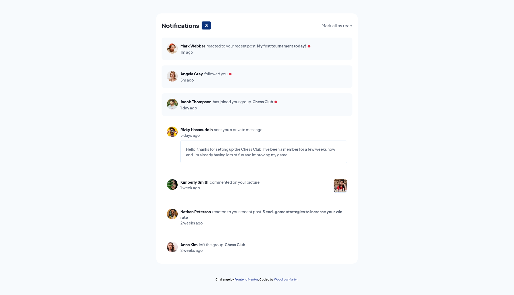

# Frontend Mentor - Notifications page solution

This is a solution to the [Notifications page challenge on Frontend Mentor](https://www.frontendmentor.io/challenges/notifications-page-DqK5QAmKbC). Frontend Mentor challenges help you improve your coding skills by building realistic projects. 

## Table of contents

- [Overview](#overview)
  - [The challenge](#the-challenge)
  - [Screenshot](#screenshot)
  - [Links](#links)
- [My process](#my-process)
  - [Built with](#built-with)
  - [What I learned](#what-i-learned)
  - [Continued development](#continued-development)
  - [Useful resources](#useful-resources)
- [Author](#author)

## Overview

### The challenge

Users should be able to:

- Distinguish between "unread" and "read" notifications
- Select "Mark all as read" to toggle the visual state of the unread notifications and set the number of unread messages to zero
- View the optimal layout for the interface depending on their device's screen size
- See hover and focus states for all interactive elements on the page

### Screenshot



### Links

- Solution URL: [https://github.com/wmartyr/notifications-page-main](https://github.com/wmartyr/notifications-page-main)
- Live Site URL: [https://wmartyr.github.io/notifications-page-main](https://wmartyr.github.io/notifications-page-main)

## My process

### Built with

- Semantic HTML5 markup
- CSS custom properties
- Flexbox
- Mobile-first workflow

### What I learned

I learned to use a unicode character for the red dot and to center it vertically.

```css
.unread-dot {
    font-size: 0.625rem;
    vertical-align: text-top;
    line-height: 2.15;
```

### Continued development

Practice, practice, practice...

### Useful resources

- [Red dot](https://www.htmlsymbols.xyz/unicode/U+1F534) - This is where I found the red dot to use.
- [Vertically align unicode](https://www.sitepoint.com/community/t/help-with-vertical-aligning-a-unicode-symbol/385770) - This is where I got the idea how to align the unicode. 

## Author

- Github - [Woodrow Martyr](https://github.com/wmartyr)
- Frontend Mentor - [@wmartyr](https://www.frontendmentor.io/profile/wmartyr)